# Mapa mental do sistema de pecas usadas

Este mapa mostra o sistema como se fosse uma visao de cima. A ideia e ajudar a entender como as telas, os dados e os calculos se conectam.

```mermaid
mindmap
  root((Sistema de pecas usadas))
    Objetivo
      Controlar compras
      Controlar estoque
      Controlar custos
      Controlar vendas
      Calcular lucro

    Cadastros
      Origem
        Representa uma entrada de estoque
        Guarda SKU do produto
        Guarda quantidade total
        Guarda valor total
        Calcula custo unitario da entrada
        Exemplo: entrada de 5 unidades por R$ 500
      Peca
        Produto identificado por SKU
        Pode receber varias entradas
        Tem quantidade total
        Tem quantidade vendida
        Tem preco de venda
        Pode ter imagem no Supabase Storage
        Cadastro novo usa funcao transacional
      Custo da peca
        Limpeza
        Conserto
        Embalagem
        Outros custos antes da venda
      Tipos de custo
        Cadastro central dos nomes de custo
        Categoria peca
        Categoria venda
        Categoria ambos
        Pode desativar tipo usado
      Venda
        Escolhe uma peca
        Informa quantidade vendida
        Informa valor unitario
        Pode ter custos da venda
      Login
        Tela preparada com Supabase Auth
        Uso obrigatorio pode ser ativado depois

    Telas
      Inicio
        Atalhos para as areas principais
      Painel geral
        Mostra total investido
        Mostra total vendido
        Mostra lucro geral
        Mostra estoque e pecas vendidas
        Conta origens no lucro e no prejuizo
        Mostra ultimas vendas
        Mostra alertas inteligentes
      Analise por produto
        Mostra receita por peca
        Mostra custo da venda
        Mostra custos adicionais
        Mostra lucro por peca
        Mostra quantidade vendida
        Mostra ranking de produtos mais vendidos
      Analise por periodo
        Filtra vendas por data inicial e data final
        Mostra total vendido
        Mostra custo dos produtos vendidos
        Mostra custos de venda
        Mostra lucro do periodo
      Analise de custos
        Agrupa custos por tipo
        Separa custos da peca e custos da venda
        Mostra distribuicao por origem
      Giro de estoque
        Mostra pecas rapidas
        Mostra pecas em atencao
        Mostra pecas paradas
        Mostra pecas sem venda
      Alertas
        Mostra pecas sem estoque
        Mostra estoque baixo
        Mostra lotes esgotados
        Mostra lotes com saldo baixo
        Mostra pecas sem entrada de estoque
        Mostra vendas sem custo calculado
        Mostra vendas com lucro negativo
      Cadastro de origem
        Cria uma origem
        Salva valor pago
      Cadastro de peca
        Cria peca vinculada a origem
        Define quantidade
        Pode enviar imagem da peca
        Cria peca e entrada em uma transacao no banco
      Tipos de custo
        Cria tipos usados em custos de pecas e vendas
        Edita nome e categoria
        Desativa tipos usados em registros antigos
      Produtos
        Lista pecas
        Mostra estoque
        Mostra custo unitario
        Mostra custo vendido
        Mostra lucro
        Permite vender
        Permite editar
        Permite adicionar ou trocar imagem
      Entradas de estoque
        Lista entradas de estoque
        Mostra quantidade consumida
        Mostra saldo disponivel
        Mostra status do lote
      Detalhes da origem
        Mostra pecas da origem
        Mostra rateio
        Mostra investimento
        Mostra total vendido
        Mostra lucro atual
        Mostra status financeiro
        Mostra faturamento
        Mostra resultado da origem
      Detalhes da peca
        Mostra dados completos
        Mostra custos
        Mostra vendas
        Mostra lucro da peca
      Detalhes da venda
        Mostra custo detalhado da venda
        Mostra lotes consumidos
        Mostra custo total da venda
      Cadastro de venda
        Registra venda
        Baixa quantidade disponivel
      Historico de vendas
        Lista vendas feitas
      Relatorios
        Pagina legada mantida como apoio
        Contem blocos antigos que podem ser migrados depois

    Banco de dados
      Supabase
        Guarda os dados online
        Usa PostgreSQL
        Usa Storage para imagens
        Tem Auth preparado para login
      Tabelas principais
        origens
          id
          descricao
          valor pago
          data da compra
        pecas
          id
          origem id
          nome
          quantidade
          quantidade vendida
          preco venda
        custos peca
          peca id
          tipo
          tipo custo id
          descricao
          valor
        vendas
          peca id
          quantidade vendida
          valor unitario
          valor total
        entradas estoque
          peca id
          origem id
          quantidade total
          quantidade consumida
          custo unitario
        venda consumos estoque
          venda id
          entrada estoque id
          quantidade consumida
          custo total
        custos venda
          venda id
          tipo
          tipo custo id
          valor
        tipos custo
          id
          nome
          categoria
          ativo
        pecas imagens
          imagem url
          bucket pecas no Storage
      Funcoes do banco
        registrar venda fifo
          Salva venda
          Consome lotes antigos primeiro
          Registra consumos
          Salva custos da venda
        criar peca com entrada
          Cria peca
          Cria entrada de estoque
          Atualiza quantidade
          Faz tudo em uma transacao

    Logica de estoque
      Quantidade total
        Quantas unidades existem da peca
      Quantidade vendida
        Quantas unidades ja sairam
      Quantidade disponivel
        quantidade total menos quantidade vendida
      Status
        Em estoque
        Vendida
      Giro
        Rapido vendeu nos ultimos 15 dias
        Atencao sem venda entre 16 e 30 dias
        Parado sem venda ha mais de 30 dias
        Sem venda nunca vendeu

    Logica de custo base
      Produto tem SKU
      Origens viram entradas do SKU
      Cada entrada tem quantidade total
      Cada entrada tem valor total
      Custo unitario da entrada
        valor total da entrada dividido pela quantidade total
      Custo da venda
        soma dos lotes consumidos na venda
      Regra interna de consumo
        Entrada por lote
        Venda consome entradas antigas primeiro
        Lucro real por venda
        Registra quais lotes foram consumidos
        Bloqueia venda se nao houver saldo nas entradas
      Cadastro transacional de peca
        Evita criar peca sem entrada
        Evita entrada sem peca
        Mantem estoque e lote coerentes

    Logica de lucro
      Receita
        quantidade vendida vezes valor unitario de venda
      Painel geral
        total investido igual soma das origens
        total vendido igual soma das vendas
        lucro geral igual total vendido menos investimento e custos
      Resultado da origem
        investimento igual valor pago da origem
        total vendido igual vendas das pecas da origem
        lucro atual igual receita menos custos
        status mostra se deu lucro ou ainda nao pagou
      Custos da peca
        limpeza
        conserto
        preparo
        outros
      Custos da venda
        embalagem
        comissao
        frete
        outros
      Tipos de custo
        Sao nomes padronizados
        Podem valer para peca venda ou ambos
        Mantem compatibilidade com custos antigos
      Formula
        lucro igual receita menos custo da venda menos custos da peca menos custos extras

    Imagens das pecas
      Cadastro de peca
        Envia imagem inicial
      Produtos
        Mostra card com imagem ou iniciais
        Permite adicionar imagem em peca existente
      Detalhes da peca
        Permite trocar imagem
      Supabase Storage
        Bucket pecas
        URL publica salva em pecas imagem url

    Fluxo principal
      Cadastrar origem
        Informa SKU
        Informa quantidade da entrada
        Informa valor total
      Cadastrar pecas
        Cria o produto base com SKU
        Pode enviar imagem
      Sistema gera entrada de estoque
        Usa quantidade e valor da entrada
        Funcao transacional garante peca e lote juntos
      Configurar tipos de custo
        Define nomes padronizados
        Evita digitar tipos diferentes para o mesmo custo
      Lancar custos
        Adiciona gastos extras da peca
        Usa tipos cadastrados
      Vender peca
        Informa quantidade e valor
        Sistema consome entradas antigas primeiro
        Permite custos extras da venda
        Sistema atualiza quantidade vendida
      Conferir resultado
        Produtos
        Detalhes
        Painel geral
        Analises
        Alertas

    Arquivos do projeto
      paginas
        Arquivos HTML das telas
      css
        style.css
        Visual do sistema
      js
        Regras e interacoes do front-end
        Conexao com Supabase
        supabase-service centraliza chamadas ao banco
        financeiro-utils centraliza calculos financeiros
      sql
        Tabelas e funcoes do banco
        04 fifo estrutura lotes
        05 funcao registrar venda fifo
        06 imagens das pecas
        07 criar peca com entrada
        08 tipos de custo
      docs
        Documentacao para estudo
```



## Explicacao simples do sistema

O sistema comeca por uma **origem**. A origem representa uma compra, um lote ou uma entrada de pecas. Ela tem um valor pago.

Depois voce cadastra as **pecas** dessa origem. Cada peca tem uma quantidade. O sistema usa essas quantidades para descobrir o custo base real de cada unidade.

Exemplo:

```text
Origem: lote comprado por R$ 500

Pecas da origem:
- Peca A: quantidade 2
- Peca B: quantidade 3

Total de unidades = 2 + 3 = 5
Custo unitario = 500 / 5 = R$ 100
```

Se vender 2 unidades, o custo base vendido sera:

```text
2 x R$ 100 = R$ 200
```

O lucro aparece depois que o sistema compara o dinheiro que entrou com os custos:

```text
lucro = receita - custo vendido - custos da peca - custos da venda
```

O sistema tambem tem telas de acompanhamento:

- **Painel geral** mostra resumo do negocio, resultado por origem e ultimas vendas.
- **Analise por produto** mostra lucro por peca e ranking dos produtos mais vendidos.
- **Analise por periodo** mostra resultado financeiro filtrado por datas.
- **Analise de custos** mostra os custos agrupados por tipo e por origem.
- **Giro de estoque** mostra pecas rapidas, em atencao, paradas ou sem venda.
- **Alertas** mostra pontos de atencao, como falta de estoque, lotes baixos e vendas sem custo calculado.
- **Tipos de custo** ajuda a padronizar nomes como Limpeza, Frete, Comissao e Outros.
- **Produtos e detalhes da peca** tambem cuidam das imagens salvas no Supabase Storage.

## Como pensar no projeto

Pense no sistema em cinco partes:

1. **Entrada**
   Origem e pecas entram no estoque.

2. **Preparacao**
   Custos extras e imagens podem ser adicionados na peca.

3. **Saida**
   A venda registra quantas unidades foram vendidas e por quanto.

4. **Resultado**
   Produtos, detalhes, painel, analises e alertas mostram estoque, custo, lucro e pontos de atencao.

5. **Configuracao**
   Tipos de custo e login/Auth ficam preparados para organizar e proteger o sistema conforme ele evoluir.

## Onde olhar quando tiver duvida

- Para entender telas: veja a pasta `paginas`.
- Para entender visual: veja `css/style.css`.
- Para entender regras do front-end: veja a pasta `js`.
- Para entender banco de dados: veja a pasta `sql`.
- Para estudar o sistema: veja a pasta `docs`.
